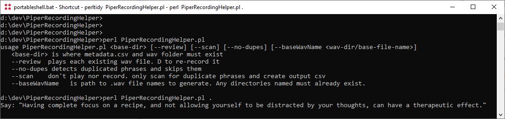

# PiperRecordingHelper
perl script to aid recording for piper model creation

I use WriteLog for contesting. Phone contesting automation using recorded wav
files has been the conventional way. But WriteLog 12.93 introduced the ability to
use Piper Text-To-Speech. This repository presents an alternative way to create the
necessary recordings of your voice need to create a piper model suitable for
contesting.

I evaluated the https://github.com/rhasspy/piper-recording-studio for creating
the necessary .wav files to model my own voice. But I found I needed to use more 
ham radio lingo in my recordings, and I simply preferred to use http://audacityteam.org
to do the recording. So I wrote the PiperRecordingHelper.pl here.

If you want to record the way I did, you'll need two prerequisities:
a) install http://audacityteam.org
b) install https://strawberryperl.com/

This perl script doesn't care how you install either of the above, but for
full disclosure, in both cases above, I did not run their install msi or exe files
but instead chose their .zip versions. I just unzipped the downloadable zip and
ran audicity.exe from one and portableshell.bat from the other.

To install PiperRecordingHelper, use the "Code" button on https://github.com/w5xd/PiperRecordingHelper#
and either git clone it or unzip it. You may run the perl script in this repo's main directory like
in this picture:

It will prompt you for the first phrase. Record a wav file and save it into this
same directory. The name doesn't matter except that it must end ".wav". The script
will notice it, rename it to the file named in metadata.csv and then continue to the
next phrase. 

I used my station microphone to record.

Once recorded, I found these instructions to work for turning the recorded wav files into a piper
model:
https://ssamjh.nz/create-custom-piper-tts-voice/
But, using the perl script above to record my wav files, I skipped the recording steps there 
and started with the section labeled "Piper TTS".
Per those instructions, I started with the lessac "medium" model, which reports itself
as epoch=2164. Then I trained it (using my own recorded voice) to both epoch=3000 and 
epoch=4000. Even the epoch=3000 voice was, in my own opinion, quite usable for contesting,
and better than recording individual wav files as is traditionally done with WriteLog.

It took roughly 7 hours on an Nvidia RTX-A5000 GPU for each 1000 epochs.

